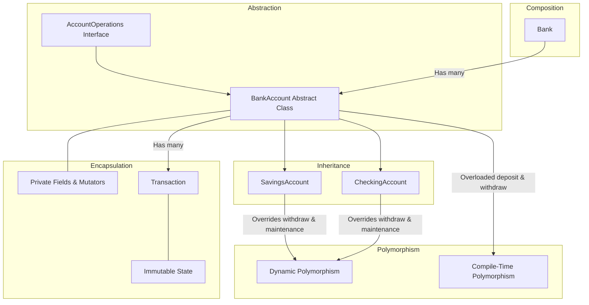

# Line-by-Line Code Explanation & OOP Architecture Guide

This document provides an exhaustive, line-by-line and component-by-component architectural explanation of the **Banking System Application**. It is designed to demonstrate how core Object-Oriented Programming (OOP) principles and Java design patterns are implemented across every file in this project.

---

## Table of Contents
1. [Core OOP Principles in this Project](#core-oop-principles-in-this-project)
2. [File 1: TransactionType.java](#file-1-transactiontypejava)
3. [File 2: InsufficientFundsException.java](#file-2-insufficientfundsexceptionjava)
4. [File 3: InvalidAmountException.java](#file-3-invalidamountexceptionjava)
5. [File 4: AccountNotFoundException.java](#file-4-accountnotfoundexceptionjava)
6. [File 5: Transaction.java](#file-5-transactionjava)
7. [File 6: AccountOperations.java (Interface)](#file-6-accountoperationsjava-interface)
8. [File 7: BankAccount.java (Abstract Base Class)](#file-7-bankaccountjava-abstract-base-class)
9. [File 8: SavingsAccount.java (Subclass)](#file-8-savingsaccountjava-subclass)
10. [File 9: CheckingAccount.java (Subclass)](#file-9-checkingaccountjava-subclass)
11. [File 10: Bank.java (Composition & Management)](#file-10-bankjava-composition--management)
12. [File 11: Main.java (Console User Interface)](#file-11-mainjava-console-user-interface)

---

## Core OOP Principles in this Project



1. **Encapsulation**: 
   - State variables (`balance`, `accountNumber`, `accountHolder`, `transactions`) are marked `private` or `protected`.
   - Access to internal state is strictly regulated via public getter methods and controlled mutator methods (`deposit()`, `withdraw()`, `transfer()`) that enforce domain validation and invariant rules.
2. **Abstraction**:
   - `AccountOperations` interface establishes an operational contract without revealing implementation mechanics.
   - `BankAccount` is an `abstract class` that handles shared banking infrastructure while enforcing that specific account behaviors (`withdraw`, `applyMonthlyMaintenance`) must be defined by concrete subclasses.
3. **Inheritance**:
   - `SavingsAccount` and `CheckingAccount` extend `BankAccount`, inheriting its identification, balance tracking, statement auditing, and transfer capabilities without duplicating code.
4. **Polymorphism**:
   - **Dynamic (Runtime) Polymorphism**: Overridden methods (`withdraw()`, `applyMonthlyMaintenance()`, `getAccountType()`, `displayAccountInfo()`) execute specific logic depending on the runtime instance type.
   - **Static (Compile-Time) Polymorphism**: Overloaded methods (`deposit(double)` vs `deposit(double, String)`, and `withdraw(double)` vs `withdraw(double, String)`) provide multiple calling signatures.
5. **Composition**:
   - `Bank` *has-a* collection of `BankAccount` objects (`Map<String, BankAccount>`).
   - `BankAccount` *has-a* collection of `Transaction` audit records (`List<Transaction>`).

---

## File 1: TransactionType.java

This file defines a strongly-typed enum for categorization of financial events.

```java
1: public enum TransactionType {
2:     DEPOSIT,
3:     WITHDRAWAL,
4:     TRANSFER_IN,
5:     TRANSFER_OUT,
6:     INTEREST,
7:     FEE
8: }
```

### Detailed Line Breakdown:
- **Line 1 (`public enum TransactionType`)**: Declares a public enumeration. Enums in Java are type-safe constants that prevent invalid arbitrary strings from being assigned as transaction types.
- **Line 2 (`DEPOSIT`)**: Enum constant representing incoming funds.
- **Line 3 (`WITHDRAWAL`)**: Enum constant representing money taken out.
- **Line 4 (`TRANSFER_IN`)**: Enum constant representing incoming funds transferred from another account.
- **Line 5 (`TRANSFER_OUT`)**: Enum constant representing outgoing funds transferred to another account.
- **Line 6 (`INTEREST`)**: Enum constant representing interest earnings credited to savings accounts.
- **Line 7 (`FEE`)**: Enum constant representing maintenance fees or overdraft protection charges.
- **Line 8 (`}`)**: Closes the enum declaration.

---

## File 2: InsufficientFundsException.java

Custom checked exception for overdraft limit or minimum balance violations.

```java
1: public class InsufficientFundsException extends Exception {
2:     public InsufficientFundsException(String message) {
3:         super(message);
4:     }
5: }
```

### Detailed Line Breakdown:
- **Line 1 (`public class InsufficientFundsException extends Exception`)**: Creates a custom checked exception extending Java's built-in `java.lang.Exception`. This forces calling code to handle or declare fund shortfall scenarios.
- **Line 2 (`public InsufficientFundsException(String message)`)**: Constructor accepting a descriptive error message explaining why the transaction failed.
- **Line 3 (`super(message);`)**: Invokes the parent `Exception` constructor using `super` to store the error message in the exception hierarchy.
- **Line 4 (`}`)**: Closes the constructor.
- **Line 5 (`}`)**: Closes the class.

---

## File 3: InvalidAmountException.java

Custom checked exception for invalid transaction parameters (e.g., negative or zero monetary inputs).

```java
1: public class InvalidAmountException extends Exception {
2:     public InvalidAmountException(String message) {
3:         super(message);
4:     }
5: }
```

### Detailed Line Breakdown:
- **Line 1 (`public class InvalidAmountException extends Exception`)**: Declares custom checked exception for invalid monetary amounts (e.g. `<= 0`).
- **Line 2 (`public InvalidAmountException(String message)`)**: Single-argument constructor accepting the validation failure explanation.
- **Line 3 (`super(message);`)**: Passes the error message up to the base `Exception` class.
- **Line 4-5 (`}`)**: Closes the constructor and class definitions.

---

## File 4: AccountNotFoundException.java

Custom checked exception thrown when an account number lookup fails.

```java
1: public class AccountNotFoundException extends Exception {
2:     public AccountNotFoundException(String message) {
3:         super(message);
4:     }
5: }
```

### Detailed Line Breakdown:
- **Line 1 (`public class AccountNotFoundException extends Exception`)**: Declares custom checked exception when an account cannot be located in the bank registry.
- **Line 2 (`public AccountNotFoundException(String message)`)**: Constructor taking the error detail string.
- **Line 3 (`super(message);`)**: Passes the message to Java's base `Exception` constructor.
- **Line 4-5 (`}`)**: Closes the constructor and class.

---

## File 5: Transaction.java

Represents an immutable ledger record for every monetary movement.

```java
1: import java.time.LocalDateTime;
2: import java.time.format.DateTimeFormatter;
3: import java.util.UUID;
4: 
5: public class Transaction {
6:     private final String transactionId;
7:     private final TransactionType type;
8:     private final double amount;
9:     private final double balanceAfter;
10:     private final LocalDateTime timestamp;
11:     private final String description;
12: 
13:     private static final DateTimeFormatter FORMATTER = DateTimeFormatter.ofPattern("yyyy-MM-dd HH:mm:ss");
14: 
15:     public Transaction(TransactionType type, double amount, double balanceAfter, String description) {
16:         this.transactionId = "TXN-" + UUID.randomUUID().toString().substring(0, 8).toUpperCase();
17:         this.type = type;
18:         this.amount = amount;
19:         this.balanceAfter = balanceAfter;
20:         this.timestamp = LocalDateTime.now();
21:         this.description = description;
22:     }
23: 
24:     public String getTransactionId() {
25:         return transactionId;
26:     }
27: 
28:     public TransactionType getType() {
29:         return type;
30:     }
31: 
32:     public double getAmount() {
33:         return amount;
34:     }
35: 
36:     public double getBalanceAfter() {
37:         return balanceAfter;
38:     }
39: 
40:     public LocalDateTime getTimestamp() {
41:         return timestamp;
42:     }
43: 
44:     public String getDescription() {
45:         return description;
46:     }
47: 
48:     public String getFormattedTimestamp() {
49:         return timestamp.format(FORMATTER);
50:     }
51: 
52:     @Override
53:     public String toString() {
54:         return String.format("[%s] %-12s | Type: %-12s | Amount: $%10.2f | Balance: $%10.2f | Note: %s",
55:                 getFormattedTimestamp(), transactionId, type, amount, balanceAfter, description);
56:     }
57: }
```

### Detailed Line Breakdown:
- **Lines 1–3**: Imports `LocalDateTime` and `DateTimeFormatter` from `java.time` for modern date/time handling, and `UUID` for generating unique transaction IDs.
- **Line 5 (`public class Transaction`)**: Declares the public `Transaction` class.
- **Lines 6–11**:
  - `private final String transactionId`: Unique identifier (e.g. `TXN-A1B2C3D4`).
  - `private final TransactionType type`: Type of transaction (Enum).
  - `private final double amount`: Monetary value of the transaction.
  - `private final double balanceAfter`: Snapshot of account balance immediately following the transaction.
  - `private final LocalDateTime timestamp`: Precise date and time when the transaction occurred.
  - `private final String description`: Remarks/memo for the transaction.
  - *OOP Concept*: **Encapsulation & Immutability** — All fields are marked `private final` so that once a transaction record is created, its audit trail cannot be modified.
- **Line 13 (`private static final DateTimeFormatter FORMATTER...`)**: A shared, thread-safe date-time formatter configured for `"yyyy-MM-dd HH:mm:ss"`.
- **Lines 15–22 (`public Transaction(...)`)**: Constructor that initializes all transaction properties and generates a unique uppercase 8-character UUID prefix.
- **Lines 24–46 (`getters`)**: Standard getter methods providing read-only access to internal fields (Encapsulation).
- **Lines 48–50 (`getFormattedTimestamp()`)**: Returns the formatted timestamp string.
- **Lines 52–56 (`@Override public String toString()`)**: Overrides `Object.toString()` to produce a formatted tabular ledger row for account statements.

---

## File 6: AccountOperations.java (Interface)

Defines the contract for banking operations, demonstrating the **Abstraction** pillar.

```java
1: import java.util.List;
2: 
3: public interface AccountOperations {
4:     void deposit(double amount) throws InvalidAmountException;
5:     void deposit(double amount, String description) throws InvalidAmountException;
6:     void withdraw(double amount) throws InvalidAmountException, InsufficientFundsException;
7:     void withdraw(double amount, String description) throws InvalidAmountException, InsufficientFundsException;
8:     void transfer(AccountOperations targetAccount, double amount) throws InvalidAmountException, InsufficientFundsException;
9:     
10:     double getBalance();
11:     String getAccountNumber();
12:     String getAccountHolder();
13:     String getAccountType();
14:     
15:     void displayAccountInfo();
16:     List<Transaction> getTransactionHistory();
17:     void applyMonthlyMaintenance();
18: }
```

### Detailed Line Breakdown:
- **Line 3 (`public interface AccountOperations`)**: Declares an interface specifying what operations any bank account must support, without specifying *how* they are implemented (**Pure Abstraction**).
- **Lines 4–5 (`deposit`)**: Overloaded deposit signatures showing **Compile-Time Polymorphism**.
- **Lines 6–7 (`withdraw`)**: Overloaded withdrawal signatures declaring checked exceptions `InvalidAmountException` and `InsufficientFundsException`.
- **Line 8 (`transfer`)**: Declares transfer method receiving any object implementing `AccountOperations` as the target, enabling polymorphic inter-account transfers.
- **Lines 10–13 (`getBalance`, `getAccountNumber`, `getAccountHolder`, `getAccountType`)**: Contract for accessing account metadata.
- **Line 15 (`displayAccountInfo`)**: Prints summary card of the account.
- **Line 16 (`getTransactionHistory`)**: Returns list of audit transactions.
- **Line 17 (`applyMonthlyMaintenance`)**: Declares monthly processing routine (interest or fee assessment).

---

## File 7: BankAccount.java (Abstract Base Class)

Implements `AccountOperations` and provides core shared state and business logic for all account types.

```java
1: import java.time.LocalDateTime;
2: import java.time.format.DateTimeFormatter;
3: import java.util.ArrayList;
4: import java.util.Collections;
5: import java.util.List;
6: 
7: public abstract class BankAccount implements AccountOperations {
8:     private final String accountNumber;
9:     private final String accountHolder;
10:     protected double balance;
11:     private final LocalDateTime creationDate;
12:     private final List<Transaction> transactions;
13: 
14:     public BankAccount(String accountNumber, String accountHolder, double initialBalance) {
15:         if (accountNumber == null || accountNumber.trim().isEmpty()) {
16:             throw new IllegalArgumentException("Account number cannot be null or empty.");
17:         }
18:         if (accountHolder == null || accountHolder.trim().isEmpty()) {
19:             throw new IllegalArgumentException("Account holder name cannot be null or empty.");
20:         }
21:         if (initialBalance < 0) {
22:             throw new IllegalArgumentException("Initial balance cannot be negative.");
23:         }
24: 
25:         this.accountNumber = accountNumber;
26:         this.accountHolder = accountHolder.trim();
27:         this.balance = initialBalance;
28:         this.creationDate = LocalDateTime.now();
29:         this.transactions = new ArrayList<>();
30: 
31:         if (initialBalance > 0) {
32:             recordTransaction(TransactionType.DEPOSIT, initialBalance, "Initial Account Opening Deposit");
33:         }
34:     }
...
```

### Detailed Line Breakdown:
- **Line 7 (`public abstract class BankAccount implements AccountOperations`)**:
  - `abstract`: Cannot be instantiated directly; serves as the common blueprint for concrete accounts.
  - `implements AccountOperations`: Fulfills the interface contract.
- **Lines 8–12**:
  - `private final String accountNumber`: Immutable unique account identifier.
  - `private final String accountHolder`: Immutable customer name.
  - `protected double balance`: Current balance, accessible to subclasses for direct arithmetic while protected from external modification (**Encapsulation & Access Control**).
  - `private final LocalDateTime creationDate`: Timestamp of account creation.
  - `private final List<Transaction> transactions`: In-memory ledger of all transactions (**Composition**).
- **Lines 14–34 (`Constructor`)**:
  - Validates inputs using defensive programming (`IllegalArgumentException`).
  - Initializes account state and automatically records an opening deposit transaction if `initialBalance > 0`.
- **Lines 36–39 (`deposit(double amount)`)**: Overloaded deposit method that delegates to the parameterized version with a default description.
- **Lines 41–50 (`deposit(double amount, String description)`)**:
  - Validates `amount > 0` (throws `InvalidAmountException` if not).
  - Credits the account balance.
  - Logs the transaction as `TRANSFER_IN` or `DEPOSIT`.
  - Prints confirmation.
- **Lines 52–54 (`withdraw(double amount)`)**: Overloaded method delegating to `withdraw(amount, "Standard Cash Withdrawal")`.
- **Line 56 (`public abstract void withdraw(double amount, String description)...`)**:
  - **Abstract Method**: Defers the withdrawal rules (e.g. minimum balance check vs overdraft allowance) to subclasses (**Polymorphism & Abstraction**).
- **Lines 58–78 (`transfer(...)`)**:
  - Validates target account and checks against self-transfers.
  - Withdraws from source account with transfer memo.
  - Deposits into target account.
  - Demonstrates polymorphic method invocation.
- **Lines 80–83 (`recordTransaction`)**: Helper method that constructs and appends a `Transaction` object to the internal audit list.
- **Lines 85–99 (Getters)**: Accessor methods for account properties.
- **Lines 101–103 (`getTransactionHistory()`)**:
  - Returns `Collections.unmodifiableList(transactions)` to prevent external callers from mutating the transaction log (**Defensive Copying & Encapsulation**).
- **Lines 105–114 (`displayAccountInfo()`)**: Prints standard formatted account overview.

---

## File 8: SavingsAccount.java (Subclass)

Represents an interest-bearing account enforcing a minimum balance requirement.

```java
1: public class SavingsAccount extends BankAccount {
2:     private double interestRate; // Annual interest rate in percentage, e.g. 3.5 for 3.5%
3:     private final double minimumBalance; // Minimum balance requirement
4: 
5:     public SavingsAccount(String accountNumber, String accountHolder, double initialBalance, double interestRate, double minimumBalance) {
6:         super(accountNumber, accountHolder, initialBalance);
7:         if (interestRate < 0) {
8:             throw new IllegalArgumentException("Interest rate cannot be negative.");
9:         }
10:         if (minimumBalance < 0) {
11:             throw new IllegalArgumentException("Minimum balance cannot be negative.");
12:         }
13:         if (initialBalance < minimumBalance) {
14:             throw new IllegalArgumentException(String.format("Initial balance ($%.2f) cannot be less than minimum balance ($%.2f).", initialBalance, minimumBalance));
15:         }
16:         this.interestRate = interestRate;
17:         this.minimumBalance = minimumBalance;
18:     }
...
```

### Detailed Line Breakdown:
- **Line 1 (`public class SavingsAccount extends BankAccount`)**: Demonstrates **Inheritance** by extending `BankAccount`.
- **Lines 2–3**: Subclass-specific state:
  - `private double interestRate`: Annual percentage interest rate (p.a.).
  - `private final double minimumBalance`: Required minimum balance threshold.
- **Lines 5–18 (`Constructor`)**:
  - `super(accountNumber, accountHolder, initialBalance)`: Calls parent constructor to initialize base account properties.
  - Enforces that `initialBalance >= minimumBalance`.
- **Lines 20–30 (`Getters and Setters`)**: Allows inspection and controlled updating of interest rate.
- **Lines 32–35 (`getAccountType()`)**: Overrides method to return `"Savings Account"`.
- **Lines 37–51 (`withdraw(double amount, String description)`)**:
  - **Dynamic Polymorphism**: Overrides `withdraw` to verify that `balance - amount >= minimumBalance`.
  - If violated, throws `InsufficientFundsException`.
  - Otherwise, deducts funds and appends transaction record.
- **Lines 53–55 (`calculateMonthlyInterest()`)**: Computes `(balance * (interestRate / 100)) / 12.0`.
- **Lines 57–67 (`applyMonthlyMaintenance()`)**:
  - Overrides abstract method from `BankAccount`.
  - Computes monthly interest, credits balance, and records `INTEREST` transaction.
- **Lines 69–75 (`displayAccountInfo()`)**:
  - Calls `super.displayAccountInfo()` to display base info, then adds interest rate and minimum balance details (**Method Extension**).

---

## File 9: CheckingAccount.java (Subclass)

Represents an everyday transactional account supporting overdraft protection and transaction fees.

```java
1: public class CheckingAccount extends BankAccount {
2:     private double overdraftLimit;
3:     private double transactionFee;
4: 
5:     public CheckingAccount(String accountNumber, String accountHolder, double initialBalance, double overdraftLimit, double transactionFee) {
6:         super(accountNumber, accountHolder, initialBalance);
7:         if (overdraftLimit < 0) {
8:             throw new IllegalArgumentException("Overdraft limit cannot be negative.");
9:         }
10:         if (transactionFee < 0) {
11:             throw new IllegalArgumentException("Transaction fee cannot be negative.");
12:         }
13:         this.overdraftLimit = overdraftLimit;
14:         this.transactionFee = transactionFee;
15:     }
...
```

### Detailed Line Breakdown:
- **Line 1 (`public class CheckingAccount extends BankAccount`)**: Extends `BankAccount` (**Inheritance**).
- **Lines 2–3**:
  - `private double overdraftLimit`: Maximum negative balance permitted.
  - `private double transactionFee`: Fee charged when dipping into overdraft.
- **Lines 5–15 (`Constructor`)**: Initializes parent state via `super(...)` and validates overdraft and fee parameters.
- **Lines 17–33 (`Getters and Setters`)**: Encapsulated accessors and mutators.
- **Lines 35–38 (`getAccountType()`)**: Returns `"Checking Account"`.
- **Lines 40–62 (`withdraw(double amount, String description)`)**:
  - **Dynamic Polymorphism**: Overrides `withdraw` to allow spending beyond the current balance up to `balance + overdraftLimit`.
  - Throws `InsufficientFundsException` only if `amount > availableFunds`.
  - Automatically assesses `transactionFee` if overdraft is utilized.
- **Lines 64–72 (`applyMonthlyMaintenance()`)**:
  - Deducts standard monthly maintenance fee ($5.00) and logs a `FEE` transaction.
- **Lines 74–80 (`displayAccountInfo()`)**:
  - Calls `super.displayAccountInfo()` and appends overdraft limit and transaction fee details.

---

## File 10: Bank.java (Composition & Management)

Acts as the aggregate manager for bank accounts, demonstrating **Composition**.

```java
1: import java.util.Collection;
2: import java.util.Collections;
3: import java.util.LinkedHashMap;
4: import java.util.Map;
5: 
6: public class Bank {
7:     private final String bankName;
8:     private final Map<String, BankAccount> accounts;
9:     private int accountSequence;
10: 
11:     public Bank(String bankName) {
12:         if (bankName == null || bankName.trim().isEmpty()) {
13:             throw new IllegalArgumentException("Bank name cannot be null or empty.");
14:         }
15:         this.bankName = bankName.trim();
16:         this.accounts = new LinkedHashMap<>();
17:         this.accountSequence = 1000;
18:     }
...
```

### Detailed Line Breakdown:
- **Lines 1–4**: Imports collections utilities (`Collection`, `Collections`, `LinkedHashMap`, `Map`).
- **Line 6 (`public class Bank`)**: Declares the banking institution container.
- **Lines 7–9**:
  - `private final String bankName`: Name of the financial institution.
  - `private final Map<String, BankAccount> accounts`: Key-value registry mapping account numbers to `BankAccount` objects (**Composition**).
  - `private int accountSequence`: Internal sequence counter for generating sequential account numbers (`ACC-1001`, `ACC-1002`, etc.).
- **Lines 11–18 (`Constructor`)**: Initializes bank state and empty account map.
- **Lines 20–23 (`generateNextAccountNumber()`)**: Thread-safe (`synchronized`) generator for new account numbers.
- **Lines 25–30 (`openSavingsAccount(...)`)**: Factory method creating and registering a `SavingsAccount`.
- **Lines 32–37 (`openCheckingAccount(...)`)**: Factory method creating and registering a `CheckingAccount`.
- **Lines 39–44 (`findAccount(...)`)**: Looks up an account by number, throwing `AccountNotFoundException` if not found.
- **Lines 46–52 (`transferFunds(...)`)**: Looks up source and target accounts, then executes atomic transfer.
- **Lines 54–64 (`applyMonthlyMaintenanceToAll()`)**: Iterates through all registered accounts and executes `account.applyMonthlyMaintenance()`. Demonstrates **Polymorphism**: Savings accounts earn interest, Checking accounts process maintenance fees.
- **Lines 66–68 (`getAllAccounts()`)**: Returns read-only view of accounts (`Collections.unmodifiableCollection`).
- **Lines 70–76 (`getTotalBankAssets()`)**: Calculates the sum of balances across all accounts.
- **Lines 78–84 (`getBankName`, `getAccountCount`)**: Summary inspection methods.

---

## File 11: Main.java (Console User Interface)

Provides the interactive command-line interface, input validation, and demonstration workflows.

```java
1: import java.util.Collection;
2: import java.util.List;
3: import java.util.Scanner;
4: 
5: public class Main {
6:     private static final Scanner scanner = new Scanner(System.in);
7:     private static final Bank bank = new Bank("Apex Global Bank");
8: 
9:     public static void main(String[] args) {
...
```

### Detailed Line Breakdown:
- **Lines 1–3**: Imports scanner and collections.
- **Lines 6–7**: Static instance of `Scanner` for reading console input and `Bank` representing the central bank system.
- **Lines 9–42 (`main`)**:
  - Prints welcome banner.
  - Calls `seedInitialAccounts()` to initialize demo accounts for immediate testing.
  - Runs event loop presenting a 10-option menu.
  - Uses enhanced `switch` expressions (`->`) for clean dispatch.
- **Lines 44–53 (`seedInitialAccounts`)**: Pre-seeds Alice Johnson (Savings) and Bob Smith (Checking) with transaction activity.
- **Lines 55–68 (`printMainMenu`)**: Displays the terminal menu.
- **Lines 70–89 (`handleOpenSavingsAccount`)**: Prompts user for savings account fields, validates, and creates account.
- **Lines 91–110 (`handleOpenCheckingAccount`)**: Prompts user for checking account fields, validates, and creates account.
- **Lines 112–131 (`handleDeposit`)**: Locates account, prompts amount and optional memo, invokes `deposit()`.
- **Lines 133–144 (`handleWithdraw`)**: Locates account, prompts amount, invokes polymorphic `withdraw()`.
- **Lines 146–166 (`handleTransfer`)**: Handles account-to-account funds transfer with error recovery.
- **Lines 168–178 (`handleCheckBalance`)**: Displays account overview card.
- **Lines 180–205 (`handleViewTransactionHistory`)**: Renders tabular audit statement for selected account.
- **Lines 207–210 (`handleRunMonthlyMaintenance`)**: Triggers batch interest and maintenance execution.
- **Lines 212–228 (`handleListAllAccounts`)**: Prints formatted tabular summary of all bank accounts and total reserve balance.
- **Lines 230–261 (`readIntInput`, `readDoubleInput`)**: Helper methods wrapping `Scanner` in `try-catch` loops to prevent crashes from non-numeric input.

---

## Summary of Java Features Utilized

| Feature | Where It Is Used | Purpose |
| :--- | :--- | :--- |
| **Interfaces** | `AccountOperations.java` | Defines operational contract (Abstraction) |
| **Abstract Classes** | `BankAccount.java` | Shared banking logic and template methods |
| **Inheritance (`extends`)** | `SavingsAccount.java`, `CheckingAccount.java` | Reuses and extends base account behavior |
| **Method Overriding (`@Override`)** | `withdraw()`, `applyMonthlyMaintenance()`, `toString()` | Subclass-specific dynamic behavior |
| **Method Overloading** | `deposit()`, `withdraw()`, `readDoubleInput()` | Multiple method parameter signatures |
| **Custom Exceptions** | `InsufficientFundsException`, `InvalidAmountException`, etc. | Robust object-oriented error handling |
| **Enums** | `TransactionType.java` | Type-safe transaction classification |
| **Composition** | `Bank` has `BankAccount`, `BankAccount` has `Transaction` | Modular object containment |
| **Encapsulation & Immutability** | `Transaction.java`, private fields + getters | Data integrity and defensive design |
